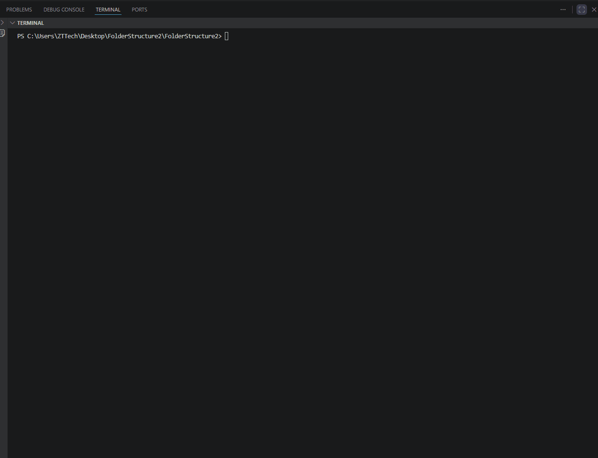

# Folder Tree Viewer (Kataloglar ierarxiyasini ko'rsatuvchi dastur)

Ushbu konsol dasturi foydalanuvchi tomonidan kiritilgan papka (path) ichidagi barcha ichki papkalar va fayllarni daraxt (tree) ko'rinishida konsolga chiqarib beradi. Dastur **C#** dasturlash tilida va **Recursion (Rekursiya)** metodologiyasi asosida yozilgan.

---

## 🚀 Dasturning ishlash prinsipi

1. **Yo'lni tekshirish:** Foydalanuvchi tizimdagi biror manzilni (path) kiritadi. Agar kiritilgan manzil mavjud bo'lmasa, dastur xatolik haqida xabar beradi va ishni to'xtatadi.
2. **Rekursiv aylanib chiqish (`ShowTree`):** * Dastur ko'rsatilgan papka ichidagi barcha quyi papkalarni (directories) oladi va ularning har biri uchun yana qaytadan `ShowTree` funksiyasini chaqiradi.
   * Papkalar tugagach, o'sha katalog ichidagi fayllarni (files) konsolga chiqaradi.
3. **Ierarxiya vizualizatsiyasi:** Har bir ichki darajaga o'tilganda, vizual farqlash uchun matn oldiga bo'sh joy (`" "`) qo'shib boriladi.

---

## 💻 Ishlash jarayoni

